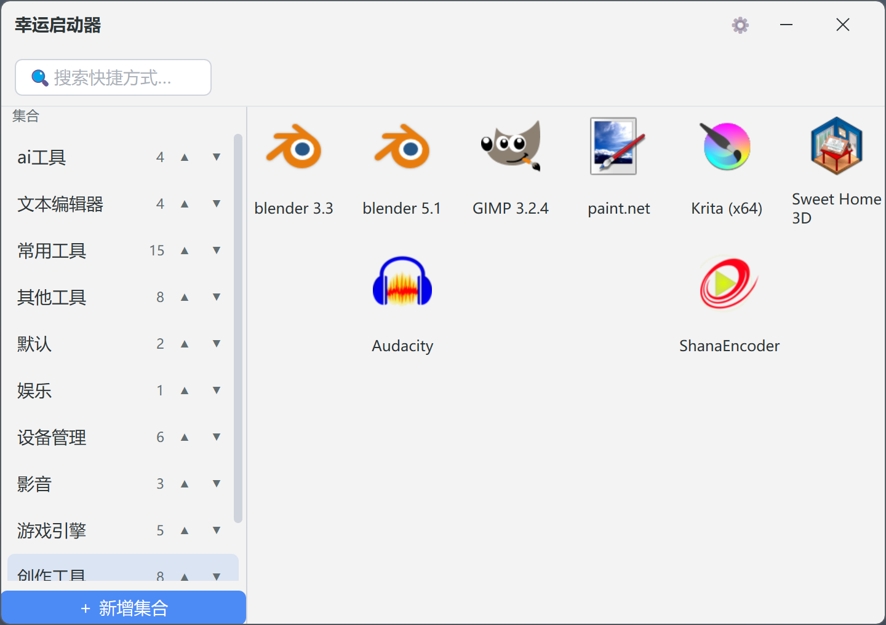

# 幸运启动器

一款简洁高效的Windows桌面快捷启动器，帮助您快速组织和访问常用软件、文件、文件夹和网页链接。



## 功能特性

- **软件快捷方式** - 快速启动您常用的应用程序
- **文件夹管理** - 通过分类整理您的启动项
- **文件支持** - 直接从启动器打开任意文件
- **网页链接** - 一键打开常用网站
- **智能搜索** - 支持拼音首字母快速检索
- **图标缓存** - 自动缓存应用图标，内存占用仅15MB左右
- **快捷键支持** - 热键唤醒启动器，提高操作效率
- **系统托盘** - 最小化到托盘，不占用任务栏空间
- **主题切换** - 支持浅色/深色主题
- **数据备份** - 支持数据导入导出

## 系统要求

- Windows 操作系统
- Rust 开发环境（用于从源码编译）

## 快速开始

### 方式一：下载安装

从 [发布页面](https://gitee.com/mzz502/lucky_launcher/releases) 下载最新版本的安装包，直接安装使用。

### 方式二：从源码编译

```bash
# 克隆gui框架
git clone https://github.com/huanfeng/wind-ui-rust.git
cd wind-ui-rust
# 克隆项目
git clone https://github.com/mzz502/lucky_launcher.git
cd lucky_launcher

# 编译运行
cargo run --release
```

## 使用说明

### 添加启动项
自动
1. 直接拖入

手动
1. 点击界面上的"添加"按钮
2. 选择要添加的内容类型（软件/文件夹/文件/网页链接）
3. 填写名称和目标路径
4. 确认保存即可

### 搜索功能

在搜索框中输入关键词，支持以下搜索方式：
- 直接输入名称进行搜索
- 使用拼音首字母快速定位（如输入"weixin"可找到微信）

### 快捷键

启动器支持以下快捷键：
- `Ctrl + Q` - 显示主窗口


### 数据管理

- **导出数据**：通过设置菜单可将您的启动项数据导出为备份文件
- **导入数据**：支持从备份文件恢复数据

## 配置说明

在设置中可以自定义以下选项：
- 主题风格（浅色/深色）
- 快捷键设置
- 显示设置
- 自动启动

## 项目结构

```
wind-ui-rust/
    lucky_launcher/
    ├── src/
    │   ├── main.rs           # 程序入口
    │   ├── model.rs          # 数据模型
    │   ├── state.rs          # 状态管理
    │   ├── storage.rs        # 数据持久化
    │   ├── search.rs         # 搜索功能
    │   ├── launch.rs         # 启动逻辑
    │   ├── hotkey.rs         # 快捷键处理
    │   ├── icon_cache.rs     # 图标缓存
    │   ├── win_utils.rs      # Windows API工具
    │   └── ui/               # 用户界面
    │       ├── collection_panel.rs  # 分类面板
    │       ├── item_grid.rs         # 项目网格
    │       ├── dialogs/             # 对话框
    │       └── theme.rs             # 主题定义
    ├── Cargo.toml            # 项目配置
    └── LICENSE               # 开源协议
```

## 技术栈

- **编程语言**：Rust
- **GUI框架**：wind-ui-rust
- **数据格式**：JSON

## 开源协议

本项目采用 GPL 3.0 协议开源。

